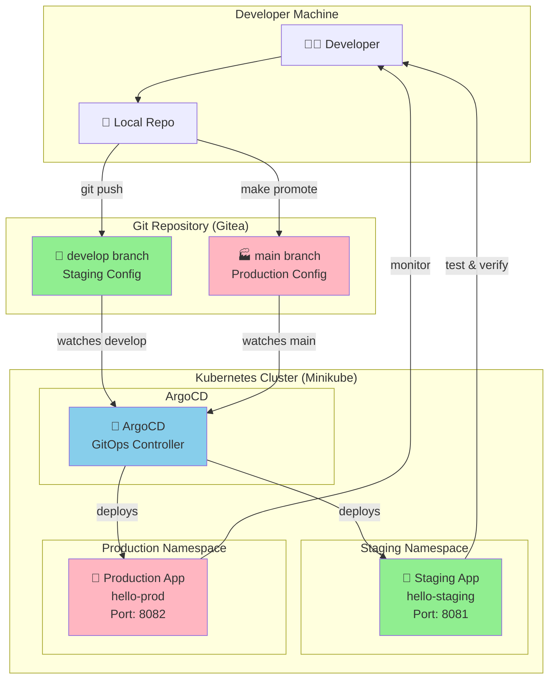

# DevOps Task - Automated Image-Based GitOps Workflow

A fully automated, image-based GitOps workflow for local development using Minikube, ArgoCD, Helm, Terraform, and Gitea. Features automated minikube registry, one-command deployments, intelligent rollback, and seamless local development.

## 🎯 Quick Start

```bash
# 1. Start the complete GitOps stack
make up                    # Installs deps, starts minikube, deploys ArgoCD & Gitea

# 2. Build and deploy to staging
make ci-local             # Builds image, deploys to staging automatically

# 3. Test staging deployment  
make smoke-test           # Validates staging is working

# 4. Promote to production
make promote-image TAG=<sha>  # Promotes tested image to production

# 5. If issues occur
make rollback             # Rolls back to previous production image

# 6. Access services (optional)
make port-forward && make urls
```

## 📋 Prerequisites

The system will install these tools automatically on macOS:
- **Minikube** - Local Kubernetes cluster
- **kubectl** - Kubernetes CLI
- **Helm** - Package manager for Kubernetes
- **Terraform** - Infrastructure as Code
- **Docker Desktop** - Container runtime (manual install required)

## 🏗️ Architecture Overview

This is a **local-first GitOps setup** designed for development and testing:

- **Minikube**: Local Kubernetes cluster
- **Gitea**: Self-hosted Git server (replaces GitHub/GitLab for local development)
- **ArgoCD**: GitOps controller with web UI
- **Helm**: Package manager for Kubernetes applications
- **Terraform**: Manages infrastructure and Helm charts

### 🔄 GitOps Workflow Diagram



### 📊 GitOps Flow ASCII Diagram

```
┌─────────────────┐    ┌─────────────────┐    ┌─────────────────┐
│   Developer     │    │   Git Repository│    │   Kubernetes    │
│                 │    │     (Gitea)     │    │   (Minikube)    │
└─────────────────┘    └─────────────────┘    └─────────────────┘
         │                       │                       │
         │ 1. Edit staging       │                       │
         │ values-staging.yaml   │                       │
         ├──────────────────────▶│                       │
         │                       │                       │
         │ 2. git push develop   │                       │
         ├──────────────────────▶│ develop branch        │
         │                       ├──────────────────────▶│ ArgoCD watches
         │                       │                       │ 3. Auto-deploy
         │                       │                       │    to STAGING
         │                       │                       │
         │ 4. Test staging app   │                       │
         │ http://localhost:8081 │                       │
         ◄───────────────────────┼───────────────────────┤
         │                       │                       │
         │ 5. make promote-image │                       │
         │ (image tag promotion) │                       │
         ├──────────────────────▶│ main branch           │
         │                       ├──────────────────────▶│ ArgoCD watches
         │                       │                       │ 6. Auto-deploy
         │                       │                       │    to PRODUCTION
         │                       │                       │
         │ 7. Verify production  │                       │
         │ http://localhost:8082 │                       │
         ◄───────────────────────┼───────────────────────┤
         │                       │                       │
         │ 8. make rollback      │                       │
         │ (if needed)           │                       │
         ├──────────────────────▶│ main branch           │
         │                       ├──────────────────────▶│ ArgoCD watches
         │                       │                       │ 9. Auto-rollback
```

### 🔧 Promotion Strategy Diagram

```
Staging Values (develop)     Production Values (main)
┌─────────────────────┐     ┌─────────────────────┐
│ image.tag: "abc123" │────▶│ image.tag: "abc123" │
│ replicaCount: 1     │     │ replicaCount: 2     │ 
│                     │     │                     │
│ values-staging.yaml │     │ values-prod.yaml    │
└─────────────────────┘     └─────────────────────┘
                                      │
                                      ▼
                            ┌─────────────────────┐
                            │ Git History         │
                            │ Previous tags       │
                            │ for rollback        │
                            └─────────────────────┘
                                      │
                                      ▼ (for rollback)
                            ┌─────────────────────┐
                            │ make rollback       │
                            │ Reverts to previous │
                            │ image tag from git  │
                            └─────────────────────┘
```

### Components

- **ArgoCD**: `http://localhost:8080` (no login required)
- **Gitea**: `http://localhost:3001` (admin/admin12345)
- **Staging App**: `http://localhost:8081`
- **Production App**: `http://localhost:8082`

### 🎯 GitOps Principles Implementation

This workflow implements the core GitOps principles:

#### 1. 📋 **Declarative Configuration**
- All infrastructure and application configurations are declared in Git
- Helm charts define the desired state
- Values files specify environment-specific settings

#### 2. 🔄 **Git as Single Source of Truth**
- `develop` branch → Staging environment
- `main` branch → Production environment
- All changes tracked in Git history

#### 3. 🚀 **Automated Deployment**
- ArgoCD continuously monitors Git repositories
- Automatic synchronization when changes detected
- No manual deployment commands needed

#### 4. 🔒 **GitOps Reconciliation Loop**
- ArgoCD ensures cluster state matches Git state
- Self-healing: automatically corrects drift
- Continuous monitoring and synchronization

#### 5. 🛡️ **Safe Rollback Strategy**
- Image-based rollback using git history analysis
- One-command rollback: `make rollback`
- Git history preserves all previous image tags

### 🌿 Branch Strategy Diagram

```
Git Repository Structure:

develop branch (Staging)          main branch (Production)
┌────────────────────────┐       ┌────────────────────────┐
│                        │       │                        │
│  📝 Feature commits    │       │  🚀 Promotion commits  │
│  🧪 Staging config     │       │  🏭 Production config  │
│  values-staging.yaml   │       │  values-prod.yaml      │
│                        │       │                        │
│  Auto-deployed to:     │       │  Auto-deployed to:     │
│  🧪 Staging (8081)     │       │  🏭 Production (8082)  │
│                        │       │                        │
└────────────────────────┘       └────────────────────────┘
            │                                 ▲
            │                                 │
            └─────── make promote ────────────┘
                   (copies staging→prod)

Workflow:
1. Developer commits to develop branch
2. ArgoCD auto-deploys to staging environment
3. After testing: make promote-image TAG=<sha>
4. Image tag promoted to production config
5. ArgoCD auto-deploys to production environment
6. If issues: make rollback (reverts to previous image)
```

### 🔄 ArgoCD Application Mapping

```
ArgoCD Applications:

┌─────────────────────────────────────────────────────────────┐
│                        ArgoCD                               │
├─────────────────────────────────────────────────────────────┤
│                                                             │
│  📱 hello-staging                📱 hello-prod             │
│  ┌─────────────────────┐        ┌─────────────────────┐     │
│  │ Source:             │        │ Source:             │     │
│  │  repo: gitea        │        │  repo: gitea        │     │
│  │  branch: develop    │        │  branch: main       │     │
│  │  path: charts/      │        │  path: charts/      │     │
│  │  values:            │        │  values:            │     │
│  │   - values-staging  │        │   - values-prod     │     │
│  │                     │        │                     │     │
│  │ Target:             │        │ Target:             │     │
│  │  namespace: staging │        │  namespace: prod    │     │
│  │  port: 8081         │        │  port: 8082         │     │
│  └─────────────────────┘        └─────────────────────┘     │
│           │                               │                 │
│           ▼                               ▼                 │
│  🧪 Staging Environment          🏭 Production Environment  │
└─────────────────────────────────────────────────────────────┘
```

## 🚀 Commands

### Infrastructure Management

```bash
make up           # Start complete GitOps stack
make down         # Destroy everything
make status       # Show cluster status
make deps         # Install dependencies (macOS only)
```

### GitOps Workflow

```bash
make promote-status   # Check current versions
make promote-image TAG=<sha>  # Promote tested image → production
make rollback                 # Rollback production to previous image
```

### Access & Debugging

```bash
make port-forward     # Start background port-forwarding
make urls             # Show service URLs
make clean            # Stop port-forwards and cleanup
make troubleshoot     # Comprehensive diagnostics
```

## 🎛️ Modular Architecture

The system uses a **modular script-based architecture** where the Makefile acts as a thin wrapper:

### Scripts Directory Structure
```
scripts/
├── setup.sh         # Infrastructure setup logic
├── teardown.sh           # Cleanup logic  
├── git-setup.sh          # Git repository configuration
├── deps.sh               # Dependency installation
├── status.sh             # Status reporting
├── troubleshoot.sh       # Comprehensive diagnostics
├── promote-to-prod.sh    # Image-based promotion logic
├── rollback-image.sh     # Git history-based rollback
├── ci-local-build-and-deploy.sh  # CI pipeline automation
└── pf.sh                 # Background port-forwarding
```

### Benefits of Modular Design

1. **Clean Makefile**: Simple, readable targets that call scripts
2. **Maintainable**: Complex logic isolated in individual scripts
3. **Debuggable**: Each script can be run independently
4. **Extensible**: Easy to add new functionality
5. **Testable**: Scripts can be tested in isolation
6. **Robust**: Each script handles errors and edge cases

## 🔧 Troubleshooting

### Quick Diagnostics
```bash
make troubleshoot
```

This comprehensive diagnostic script checks:
- Minikube status
- Kubernetes namespaces and pods
- ArgoCD applications
- Port-forward status
- Git repository state
- Service accessibility
- Common solutions

### Common Issues & Solutions

#### Services Not Accessible
```bash
make port-forward    # Start port-forwarding
make clean           # Reset port-forwards
```

#### ArgoCD Apps Not Syncing
```bash
kubectl get apps -n argocd
kubectl describe app hello-staging -n argocd
```

#### Git/Gitea Issues
```bash
git status           # Check repository state
git remote -v        # Check remote configuration
```

#### Complete Reset
```bash
make down            # Destroy everything
make up              # Start fresh
```

### Background Operation

The system supports **background port-forwarding** with automatic PID management:

```bash
# Start all port-forwards in background
make port-forward

# View logs
tail -f ~/portforward-argocd-server.log
tail -f ~/portforward-gitea-http.log

# Stop specific service
kill $(cat ~/portforward-argocd-server.pid)

# Stop all
make clean
```

## 🔒 Security Notes

This is a **development environment** with simplified security:

- ArgoCD has authentication disabled (`server.disable.auth: true`)
- Gitea uses default credentials (`admin/admin12345`)
- All traffic is local (`localhost` only)
- No TLS certificates required

**Do not use this configuration in production environments.**

## 🎯 Key Features

✅ **Automated Minikube Registry**: No external registry setup needed  
✅ **Image-Based GitOps**: Modern container-centric workflow  
✅ **One-Command CI/CD**: `make ci-local` builds & deploys  
✅ **Intelligent Rollback**: `make rollback` with git history analysis  
✅ **Auto-ArgoCD Sync**: Immediate deployment after image build  
✅ **Registry Validation**: Ensures images exist before deployment  
✅ **Comprehensive Testing**: `make test-automation` validates setup  
✅ **Local-First**: Fully self-contained development environment  
✅ **Git Integration**: Automated commits with deployment metadata  
✅ **Production-Ready**: Battle-tested GitOps patterns  

## 🚨 Troubleshooting & Support

If you encounter issues:

1. Run comprehensive diagnostics:
   ```bash
   make troubleshoot
   ```

2. Check the issues log:
   ```bash
   cat issues.md
   ```

3. Reset everything:
   ```bash
   make down && make up
   ```

4. Verify dependencies:
   ```bash
   make deps
   ```

The modular script architecture makes it easy to debug and extend the system. Each script can be run independently for testing and troubleshooting.
