# Local GitOps — Minimal

A minimal, local-first GitOps workflow using Minikube, ArgoCD, Helm, and a local Git server. Designed to get you running quickly.

## Quick start

One-command install & run (after cloning):

```bash
make deps && make up
```

Then build and deploy to staging:

```bash
make ci-local
```

Test staging:

```bash
make smoke-test
```

Promote a tested image to production:

```bash
make promote-image TAG=<image-tag>
```

To access the applications locally:

```bash
make port-forward
```

Rollback (to previous or specific tag):

```bash
make rollback            # previous
make rollback TAG=<tag>  # specific
```

## Essential commands

- `make up` / `make down` — start/stop the stack
- `make ci-local` — build in minikube, push, update values, deploy to staging
- `make promote-image TAG=<tag>` — promote image to production
- `make rollback [TAG=<tag>]` — rollback production
- `make smoke-test` — basic staging tests
- `make port-forward` — access services locally
- `make troubleshoot` — diagnostics

## Service URLs (default)

- ArgoCD: http://localhost:8080
- Staging app: http://localhost:8081
- Production app: http://localhost:8082
- Gitea: http://localhost:3001 (admin/admin12345)

## Technologies

Minikube, ArgoCD, Helm, Gitea, Docker (minikube's internal registry).

## Architecture Diagram

```mermaid
graph TB
    subgraph "💻 Local Development"
        DEV["👨‍💻 Developer"]
        LOCAL["📁 Local Repo"]
    end
    
    subgraph "🐳 Minikube Cluster"
        REG["📦 Registry<br/>:80"]
        GITEA["🔧 Gitea<br/>:3001"]
        ARGO["🔄 ArgoCD<br/>:8080"]
        STAG["🧪 Staging<br/>:8081"]
        PROD["🚀 Production<br/>:8082"]
    end
    
    DEV --> LOCAL
    LOCAL --> REG
    LOCAL --> GITEA
    GITEA --> ARGO
    ARGO --> STAG
    ARGO --> PROD
    REG --> STAG
    REG --> PROD
    
    classDef dev fill:#e8f5e8,stroke:#2e7d32
    classDef reg fill:#fff3e0,stroke:#f57c00  
    classDef git fill:#e3f2fd,stroke:#1976d2
    classDef argo fill:#f3e5f5,stroke:#7b1fa2
    classDef stag fill:#e1f5fe,stroke:#0277bd
    classDef prod fill:#ffebee,stroke:#c62828
    
    class DEV,LOCAL dev
    class REG reg
    class GITEA git
    class ARGO argo
    class STAG stag
    class PROD prod
```



## GitOps Workflow

```mermaid
sequenceDiagram
    participant Dev as 👨‍💻 Developer
    participant Local as 📁 Local Repo
    participant CI as 🔨 CI (make ci-local)
    participant Reg as 🏪 Registry
    participant Git as 📚 Git (Gitea)
    participant Argo as 🔄 ArgoCD
    participant K8s as ⚡ Kubernetes

    Dev->>+Local: 1. code change
    Dev->>+CI: 2. make ci-local
    CI->>+Reg: 3. build & push image (tag)
    CI->>+Git: 4. update values-staging.yaml & push
    Git->>+Argo: 5. ArgoCD detects commit
    Argo->>+K8s: 6. deploy to staging 🧪
    
    Note over Dev,K8s: Test staging, then promote
    
    Dev->>+Git: 7. make promote-image TAG=<tag>
    Git->>+Argo: 8. update production values
    Argo->>+K8s: 9. deploy to production 🚀
    
    Note over Dev,K8s: Rollback if needed
    
    Dev->>+Git: 10. make rollback TAG=<tag>
    Git->>+Argo: 11. update production values
    Argo->>+K8s: 12. rollback to requested image ⏮️
```



## Monitoring & Alerts

A compact set of suggested monitors and thresholds (use Prometheus + Alertmanager locally).

| Metric | What to monitor | Warning | Critical | Why |
|---|---|---:|---:|---|
| Request latency (P95) | 95th percentile latency (ms) | P95 > 200 ms for 5m | P95 > 500 ms for 2m | Impacts UX; signals performance regressions or resource contention |
| Error rate (5xx) | % of requests returning 5xx | > 1% for 5m | > 5% for 2m | Indicates app failures or misconfigurations needing immediate action |
| Request throughput (RPS) | Requests/sec | sustained drop >50% vs baseline for 5m | sustained drop >80% vs baseline for 2m | Sudden drops indicate routing/network/upstream failures |
| Pod restarts | Restart count per pod (5m) | >=1 restart in 5m | >=3 restarts in 5m or across multiple pods | Signals crashes, OOMs, or failing probes |
| CPU usage (per-pod) | CPU % of requests/limits | >80% for 5m | >95% for 2m | High CPU degrades performance; may require scaling |
| Memory usage (per-pod) | Memory % of limits | >80% for 5m | >95% or OOM events | Memory pressure can cause OOM kills and instability |

How to alert (recommended)

- Scrape app and kube metrics with Prometheus, use Alertmanager for routing.
- Send critical alerts to on-call (e.g., Slack/email), warning alerts to a team channel.
- For local testing, run Prometheus + Alertmanager + Grafana in Minikube.

## Troubleshooting (quick)

- If services are unreachable: `make port-forward`
- ArgoCD apps OutOfSync: check ArgoCD UI and run `make troubleshoot`
- Build failures: ensure Docker is running and rerun `make ci-local`

This README intentionally minimal — see scripts/ and charts/ for details.
